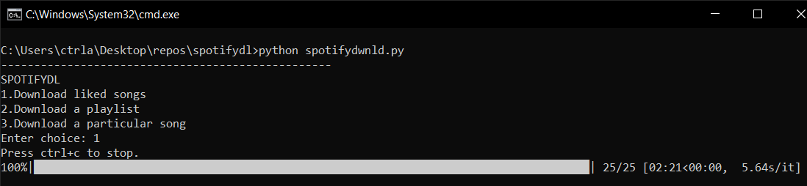
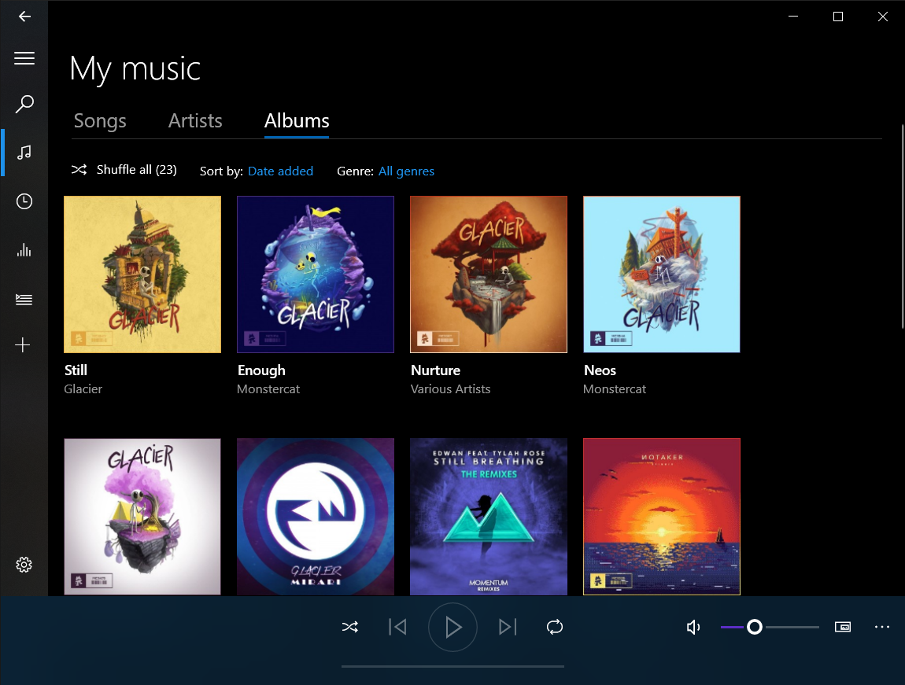

# spotifydl
Spotify downloader

## Setup
1.Create an app: https://developer.spotify.com/dashboard/applications


2.Copy the Client id and client secret


3.Set redirect uri to http://localhost:8888/callback


### Setting Environment Variables (Windows)
`set SPOTIFY_USER_ID <your_user_id>`
`set SPOTIFY_CLIENT_ID <your_client_id>`  
`set SPOTIFY_CLIENT_SECRET <your_client_secret>`  
`set SPOTIFY_REDIRECT_URI 'http://localhost:8888/callback'`  

## Usage

`python spotifydwnld.py`


## Output
```
SPOTIFYDL  
1.Download liked songs  
2.Download a playlist  
3.Download a particular song  
Enter choice:   
```

Enter a choice and it will start downloading

## Example



## Result



## How it works

```
* Program Gets the deatils of the songs from spotify api.  
* It then searches the song on youtube and extracts the youtube song url  
* The song is then downloaded as mp4 from youtube using Pytube module
* mp4 is converted to mp3 using ffmpeg  
* Tags are added to the mp3 song (Artist, title, album, album art image)  
```
