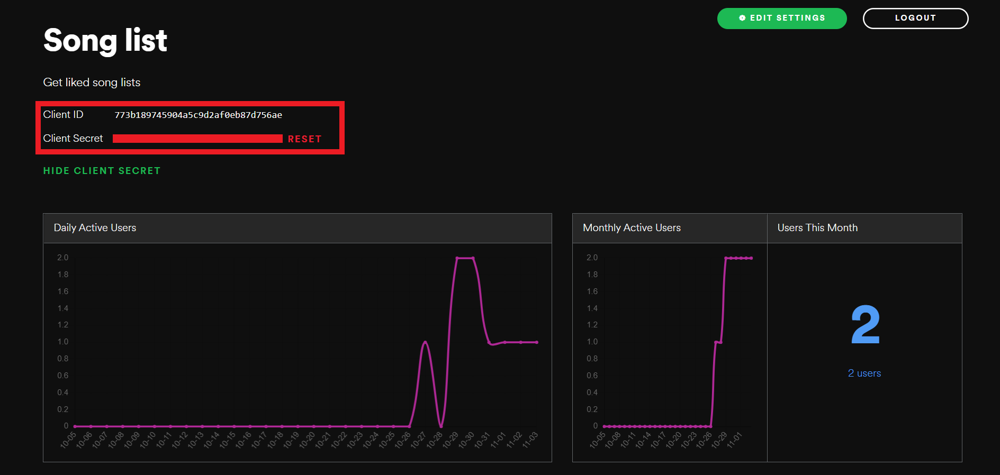
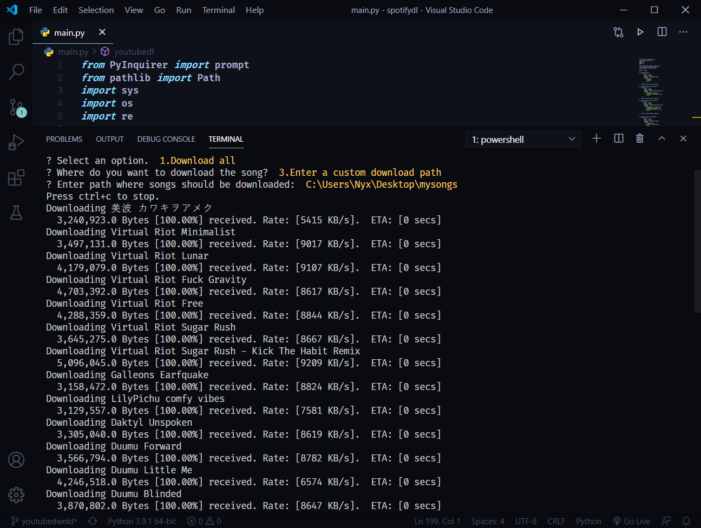
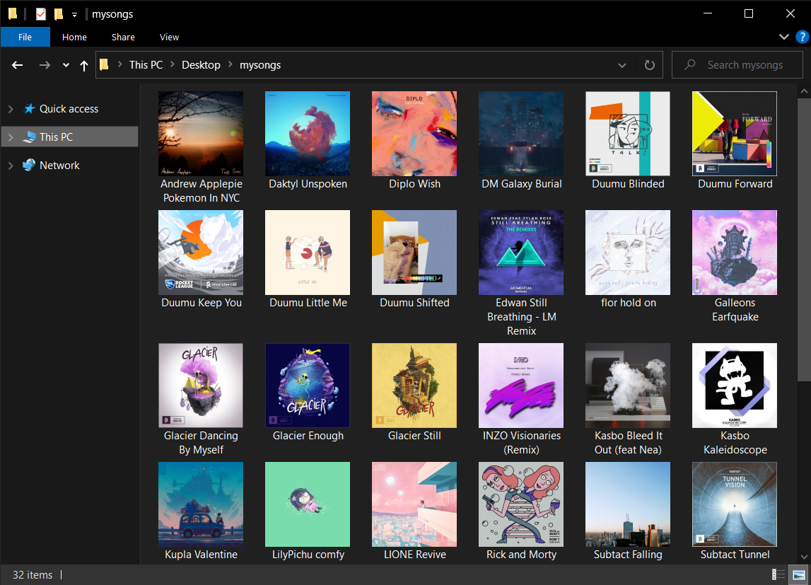
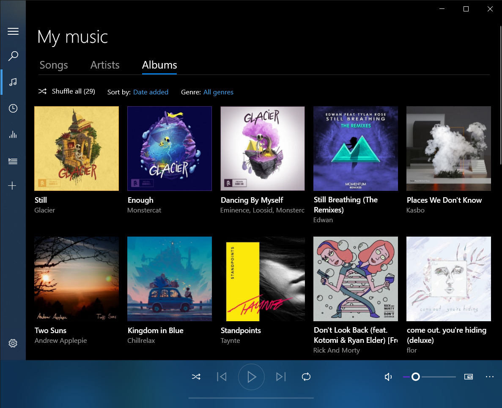

# YoutubeSpotifyDL

Youtube and Spotify downloader

## Example


## Setup

1.Create an app: https://developer.spotify.com/dashboard/applications


2.Copy the Client id and client secret



3.Set redirect uri to http://localhost:8888/callback


### Setting Environment Variables (Windows)

`setx SPOTIFY_USER_ID your_user_id`  
`setx SPOTIFY_CLIENT_ID your_client_id`  
`setx SPOTIFY_CLIENT_SECRET your_client_secret`  
`setx SPOTIFY_REDIRECT_URI 'http://localhost:8888/callback'`

Alternatively, if you want to run this program from the current directory, you could use an environment file `.env` and load the credentials from there.

Edit the `.env` file and set the credentials.

## Dependencies

To install all modules run `pip install -r requirements.txt`

## Usage

`python main.py`

## Sample Output



## Result




## How it works

```
* Program Gets the deatils of the songs from spotify api (for spotify songs)
  and youtube music api (for youtube songs)
* It then searches the song on youtube and extracts the youtube song url
* The song is then downloaded as m4a from youtube using pafy module
* Metadata are added to the m4a song (Artist, title, album, album art image)
```
