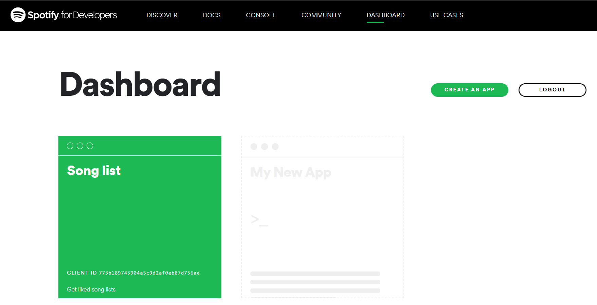
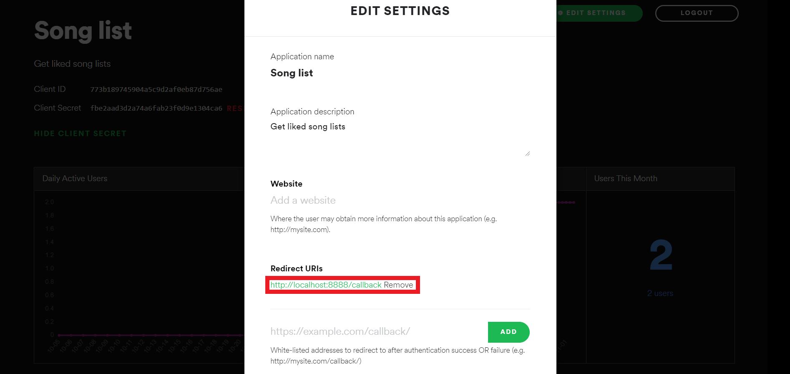

# YoutubeSpotifyDL

Youtube and Spotify downloader

## Example

## Setup

1.Create an app: https://developer.spotify.com/dashboard/applications

2.Copy the Client id and client secret and paste the values in `.env file`

3.Set redirect uri to http://localhost:8888/callback

## Setting Environment Variables

Edit the `.env` file and set the credentials.
Set the `SPOTIPY_CLIENT_ID` AND `SPOTIPY_CLIENT_SECRET` values.

## How to run

1. Clone the project  
`git clone https://github.com/piyx/YoutubeSpotifyDL.git`  
2. Navigate to the project directory. The path should look like  
`../../YoutubeSpotifyDL`
3. Install Dependencies  
`pip install -r requirements.txt`
4. Install the package locally  
`pip install .`
5. Run main.py inside ytspdl folder  
`python ytspdl/main.py`